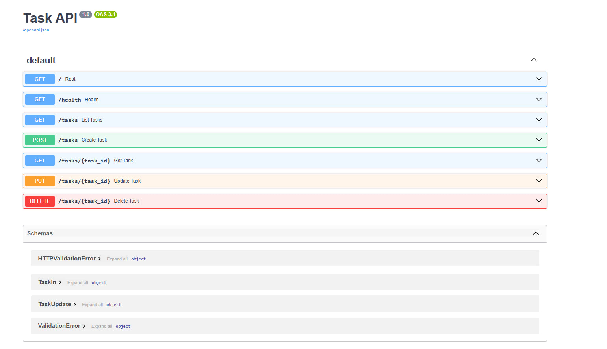
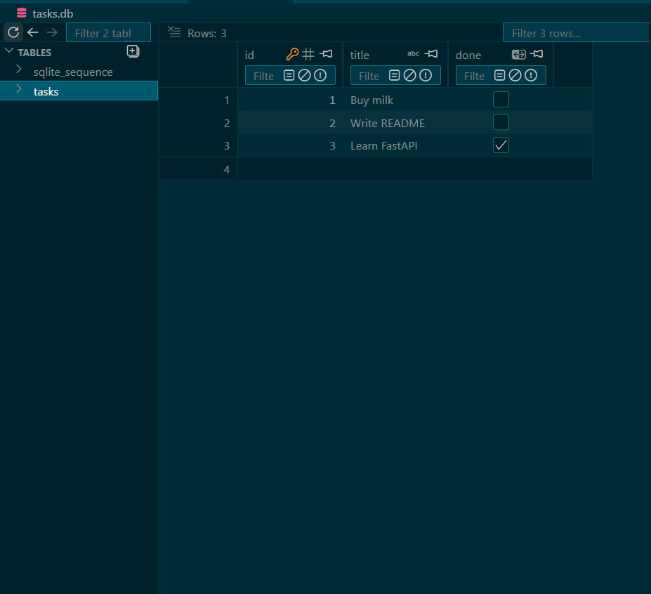

# Task API

CRUD API for a to-do list. Started as W2·A1 (in-memory only, data lost on every restart). W3·A1 swapped the storage for SQLite — the API, request bodies, and responses are unchanged; only how tasks are stored changed.

## Why SQLite

No server to install or run — it's a single file (`tasks.db`) that Python's stdlib `sqlite3` module reads/writes directly. For a small single-process API like this, that's the simplest way to get real persistence without standing up Postgres/MySQL. The tradeoff (no concurrent-writer story, no network access from other machines) doesn't matter yet at this scale.

## Where the database lives

`tasks.db`, created automatically next to `main.py` on first run (see `db.py:init_db()` — called from the FastAPI `lifespan` in `main.py`). It's gitignored: the file is generated, not source — a clone of this repo starts with no `tasks.db` and gets one automatically the first time the app runs.

## Run it

```bash
python -m venv venv
venv/Scripts/pip install -r requirements.txt
venv/Scripts/python -m uvicorn main:app --port 8000
```

Server: `http://localhost:8000` · Swagger UI: `http://localhost:8000/docs`

## Endpoints

| Method | Path | Description | Success | Errors |
|---|---|---|---|---|
| GET | `/` | API info | 200 | — |
| GET | `/health` | Liveness check | 200 | — |
| GET | `/tasks` | List all tasks | 200 | — |
| GET | `/tasks/{id}` | Get one task | 200 | 404 |
| POST | `/tasks` | Create a task (`{"title": "..."}`) | 201 | 400 (empty/missing title) |
| PUT | `/tasks/{id}` | Update title and/or done | 200 | 400, 404 |
| DELETE | `/tasks/{id}` | Delete a task | 204 | 404 |

## Example

```
$ curl -i http://localhost:8000/tasks/1
HTTP/1.1 200 OK
content-type: application/json

{"id":1,"title":"Buy milk","done":false}
```

## Swagger UI

Full CRUD cycle tested via "Try it out" at `/docs`:



## Database viewer

`tasks.db` opened in the VSCode SQLite Viewer extension, showing the `tasks` table:



One query run directly against the database (outside the API), to see the API pick up the change with no restart:

```sql
UPDATE tasks SET done = 1;
```

## Mortality experiment

A1 (in-memory): created a few tasks, restarted the server, `GET /tasks` came back with only the 3 seed tasks — the list lived in a Python variable, gone the moment the process exited.

A1 with SQLite (this version): same test — create tasks, restart the server — and they're still there. The table lives in `tasks.db` on disk, independent of the Python process's lifetime. Verified further by editing the database directly with a raw SQL query while the server was running: the next `GET /tasks` reflected the change immediately, no restart needed — proof the API is a thin layer over the database, not a second copy of the data.
